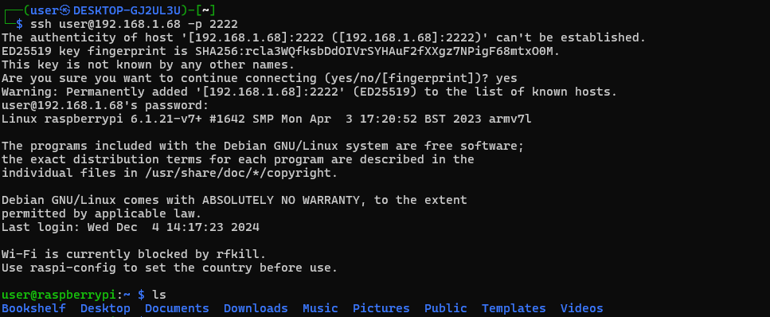

# Honey pot

# Setup

I set up a rasberry pi with ssh on my network.

Lets check the pi is up and we can ssh into it

<figure><figcaption></figcaption></figure>

Amazing now we will configure opencanary

# OpenCanary setup

We can follow the steps [here ](https://github.com/thinkst/opencanary?tab=readme-ov-file#installation-on-ubuntu)

I configure my setup file to run ftp, ssh, telnet, vnc, samba and http. I also confugred slack to send me notifications when access is attempted.

Here you can see when i attempt to check the http page I get an alert

<figure><figcaption></figcaption></figure>

Ok this is now up and running!!

# Router setup

We now want these ports to be public facing so when crawlers crawl our network we are alerted...

We need to:

1\) Set up our pi with a static local IP

2\) Set up the port fowarding rules

We first need to check whick ports are already in use on our home network to avoid conflicts. Let's run nmap with the -p- flag.

<figure><figcaption></figcaption></figure>

Next lets run nmap on our honeypot rasberry pi.

<figure><figcaption></figcaption></figure>

Something to note the 2222 port is the port we are actually using for ssh we do not want to make this public under any cercumstances!

We will do the port mapping as follows

| Service | Original Port | Public port |
| ------- | ------------- | ----------- |
| FTP     | 21            | 2121        |
| SSH     | 22            | 2222        |
| Telnet  | 23            | 2223        |
| Samba   | 139           | 139         |
| Samba   | 445           | 445         |
| VNC     | 5900          | 5900        |
| HTTP    | 80            | 8080        |

Lets now setup these rules.

<figure><figcaption></figcaption></figure>

And thats the honey pot completed!!

# Interesting findings

After a few days of running here are some noticable results:

*   We have scrapers trying to brute force our ssh constantly. The most common passwords tried were;

    ```python
    ['------fuck------', 'password', 'abc123', 'AA123456', 'root']
    ```
* This is interesting because the most popular password by a margin was the F word surrounded by dashes which would never be used in production.
* The http honeypot provides us with user agents the most interesting were;
* ```
  Mozilla/5.0 (compatible; Nmap Scripting Engine; https://nmap.org/book/nse.html)
  Mozilla/5.0 (compatible; InternetMeasurement/1.0; +https://internet-measurement.com/)
  Expanse, a Palo Alto Networks company, searches across the global IPv4 space multiple times per day to identify customers
  ```
* Nmap is expected but InternetMeasurment and Palo alto seem to be companies that scrape the entire internet daily which is fascinating so me. These are massive companies canvasing and footprinting the web!

# Further hardening

It would be good if we could find a way to make a script that auto blacklists any ip that tries to login to our SSH honeypot. There is no reason for any legitimate user to ever do this so one attempt should lead to a perminant ban. It will be interesting to see how many ips are banned in a week.

Unfortunetly after doing some checking my router only allows a blacklist of 16 ip address. So we wont be able to get this to work for all malicous IPs. I though about dropping the packets another way but in our Lan Monitor project we are just mirroring the data not tapping it so that wouldn't work. The only way would be to either buy a hardware firewall or create a buy a physical network tap.

We will end the project here for now.....
